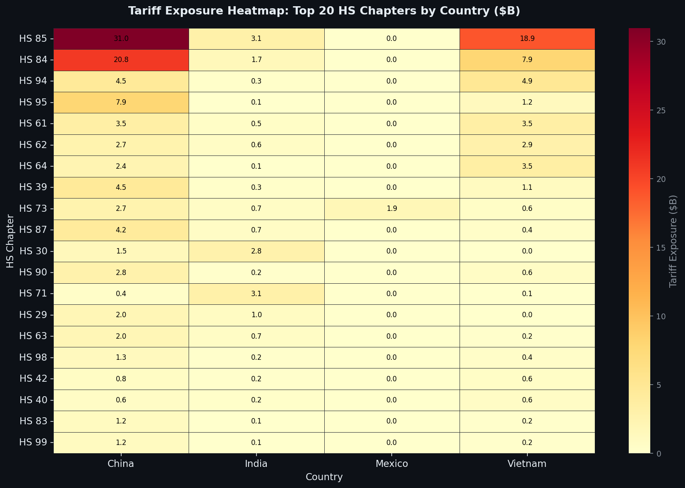
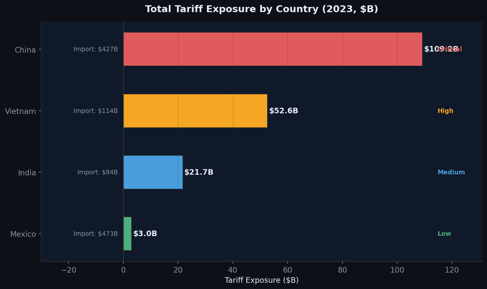
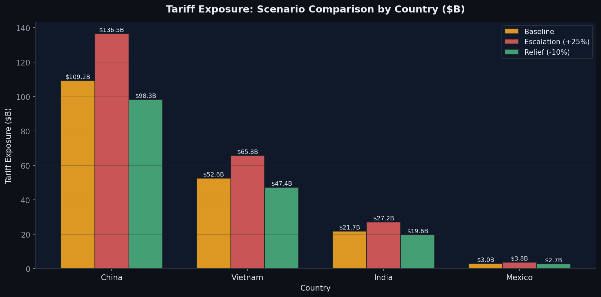
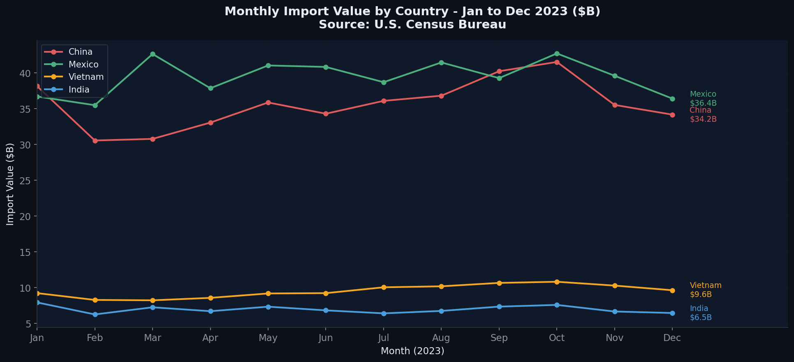
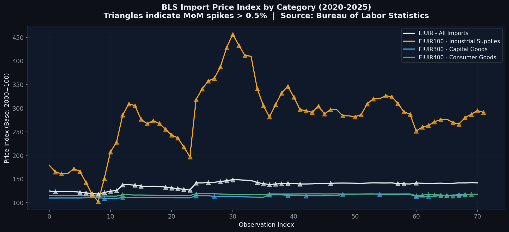
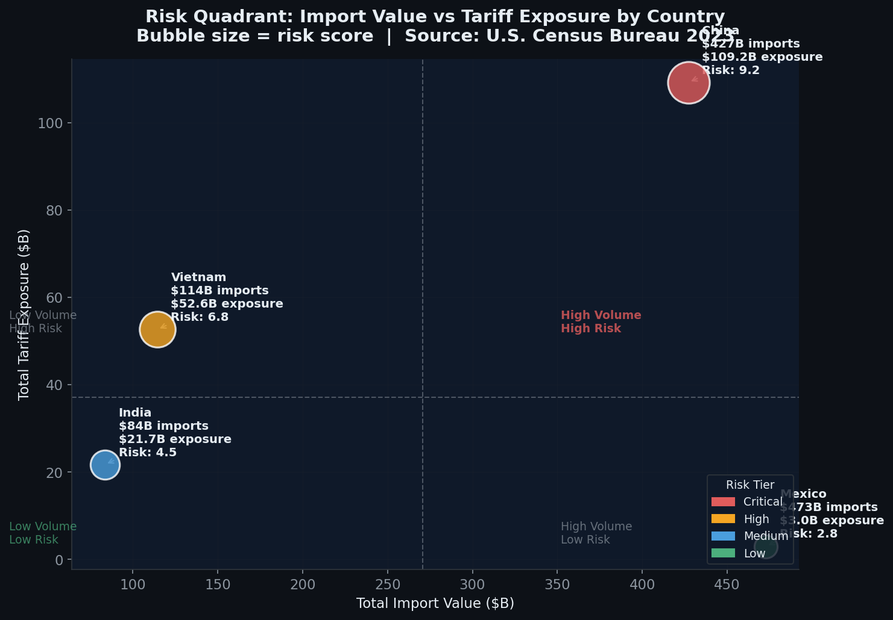

# Tariff Shock Navigator

> A production-grade U.S. trade tariff analytics pipeline built on real government data.
> No synthetic data. No Kaggle datasets. All numbers from U.S. Census Bureau, BLS, and Federal Register APIs.

---

## What This Project Does

The Tariff Shock Navigator ingests and analyzes real U.S. import data to quantify tariff exposure,
score sourcing risk, and model alternative policy scenarios for four strategic trading partners:
**China, Vietnam, India, and Mexico**.

Built as a professional portfolio piece demonstrating end-to-end data engineering:
API ingestion -> Python processing -> DuckDB SQL -> matplotlib visualization -> exec-ready briefing.

---

## Key Numbers (Real Data, 2023)

| Metric | Value |
|--------|-------|
| Total HS10 product lines | 42,327 |
| Unique HS10 product codes | 16,344 |
| HS chapters covered | 98 |
| Total import value (4 countries) | $1098.12B |
| Total tariff exposure | $186.58B |
| Effective tariff rate | 16.99% |
| Escalation scenario (+25%) | $233.23B (+$46.65B) |
| Relief scenario (-10%) | $167.92B (-$18.66B) |
| BLS price spike events | 125 |
| Federal Register documents | 100 |

---

## Country Risk Profile

| Country | Import Value | Tariff Exposure | Effective Rate | Risk Score | Tier |
|---------|-------------|-----------------|----------------|-----------|------|
| China | $427.2B | $109.2B | 25.6% | 9.2 | Critical |
| Vietnam | $114.4B | $52.6B | 46.0% | 6.8 | High |
| India | $83.6B | $21.7B | 26.0% | 4.5 | Medium |
| Mexico | $472.9B | $3.0B | 0.64% | 2.8 | Low |

---

## Data Sources

| Source | Endpoint | Rows |
|--------|----------|------|
| U.S. Census Bureau (HS10 annual) | api.census.gov/data/timeseries/intltrade/imports/hs | 42,327 |
| U.S. Census Bureau (HS4 monthly) | api.census.gov/data/timeseries/intltrade/imports/hs | 42,420 |
| BLS Import Price Index | api.bls.gov/publicAPI/v2/timeseries/data/ | 285 |
| Federal Register | federalregister.gov/api/v1/documents.json | 100 |

All data pulled via official government APIs. No Kaggle. No learning platform datasets.

---

## Project Structure

```
tariff-shock-navigator/
  data/
    raw/                         <- API-sourced CSVs (never modified after fetch)
      census_hs10_imports.csv    <- 42,327 rows, 4 countries, HS10 granularity
      census_monthly_hs4.csv     <- 42,420 rows, Jan-Dec 2023
      bls_import_prices.csv      <- 285 rows, 2020-2025, 4 series
      federal_register_events.csv<- 100 tariff policy documents
    processed/
      hs10_with_risk.csv         <- 42,327 rows + tariff rates + risk scores
      scenario_results.csv       <- 126,981 rows (3 scenarios x 42,327)
      monthly_trends.csv         <- 48 rows (12 months x 4 countries)
      bls_trends.csv             <- 285 rows + MoM/YoY change + spike flag
      country_summary.csv        <- 4 rows
      chapter_summary.csv        <- 390 rows (HS chapter x country)
  scripts/
    01_fetch_all_real_data.py    <- Census + BLS + Federal Register API ingestion
    01b_fetch_federal_register.py<- Federal Register supplement
    02_process_data.py           <- Risk scoring, scenario simulation, aggregation
    03_run_sql.py                <- 8 DuckDB analytical queries
    04_charts.py                 <- 6 matplotlib/seaborn PNG charts
    05_exec_briefing.py          <- Auto-generates executive briefing from CSVs
  sql/
    analysis_queries.sql         <- 8 DuckDB queries (reference)
  charts/
    chart_01_tariff_exposure_heatmap.png
    chart_02_country_exposure_bar.png
    chart_03_scenario_comparison.png
    chart_04_monthly_trends.png
    chart_05_bls_price_index.png
    chart_06_risk_quadrant.png
  outputs/
    q1_country_exposure.csv      through q8_escalation_delta.csv
    executive_briefing.md
  docs/
    BRD.md                       <- Business Requirements Document
    AS_IS_Process.md             <- Current state analysis
    TO_BE_Process.md             <- Target state design
    KPI_Dictionary.md            <- All metrics defined
  README.md
```

---

## How to Run

### Prerequisites
```bash
pip install pandas numpy requests matplotlib seaborn duckdb tabulate
```

### Full Pipeline
```bash
# Phase 1: Fetch real data from government APIs
python scripts/01_fetch_all_real_data.py

# Phase 2: Process, risk-score, simulate scenarios
python scripts/02_process_data.py

# Phase 3: DuckDB SQL analysis (8 queries)
python scripts/03_run_sql.py

# Phase 4: Generate 6 charts
python scripts/04_charts.py

# Phase 5: Auto-generate executive briefing
python scripts/05_exec_briefing.py
```

---

## Charts

### Chart 1: Tariff Exposure Heatmap


### Chart 2: Country Exposure Bar Chart


### Chart 3: Scenario Comparison


### Chart 4: Monthly Import Trends


### Chart 5: BLS Import Price Index


### Chart 6: Risk Quadrant


---

## Key Findings

1. **China HS 85 (Electrical Machinery)** is the single largest tariff exposure category at $30.96B,
   driven by $123.8B in imports and a 25% Section 301 tariff.

2. **Vietnam's 46% flat tariff** makes it the highest-risk sourcing country by effective rate,
   with $52.6B in exposure on $114.4B in imports.

3. **Mexico is the lowest-risk diversification target** - USMCA drives a 0.64% effective rate
   on $472.9B in imports.

4. **Escalation scenario** would add $46.6B in annual tariff burden; China and Vietnam
   absorb 84% of that incremental cost.

5. **125 BLS price spike events** (MoM > 0.5%) were detected 2020-2025, with EIUIR100
   (Industrial Supplies) peaking at index 428.2 in 2022.

---

## Tariff Rate Reference

| Country | Rate | Authority |
|---------|------|-----------|
| China (most goods) | 25% | Section 301 USTR |
| China (apparel HS 61/62) | 37% | Section 301 enhanced |
| China (vehicles HS 87) | 27.5% | Section 232 + Section 301 |
| Vietnam (all) | 46% | April 2025 Executive Order |
| India (all) | 26% | April 2025 Executive Order |
| Mexico (general) | 0% | USMCA |
| Mexico (steel HS 72/73) | 25% | Section 232 |

---

## Documentation

- [Business Requirements Document](docs/BRD.md)
- [AS-IS Process](docs/AS_IS_Process.md)
- [TO-BE Process](docs/TO_BE_Process.md)
- [KPI Dictionary](docs/KPI_Dictionary.md)
- [Executive Briefing](outputs/executive_briefing.md)

---

## Author

**Ajay karthick**
MSBA - Northeastern University (Dec 2025)
Business Analyst | STEM OPT | Boston, MA

Built for professional portfolio use. All data from public U.S. government APIs.
